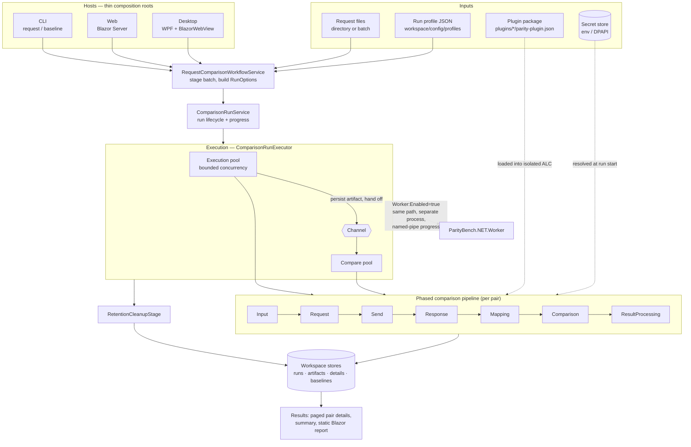
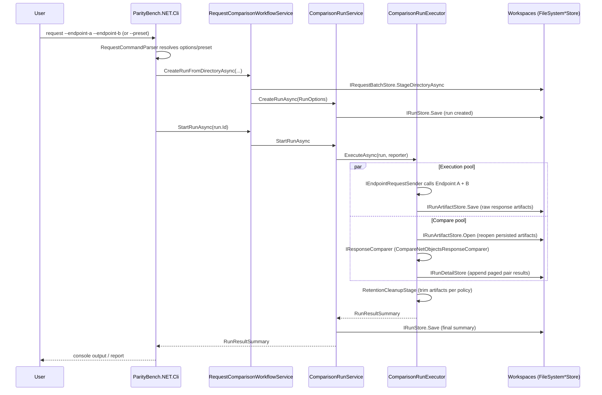

# High-Level Architecture

ParityBench.NET fires the same request at two endpoints (A and B), persists both responses as artifacts, compares them as domain objects, and appends paged results. Hosts (CLI, Web, Desktop) are thin composition roots over a shared set of application/engine/workspace services — none of them own comparison logic.

## System flow at a glance

Start here. Everything below is a detail view of one box in this diagram.

Three things this diagram is meant to make obvious:

- **Hosts are interchangeable.** CLI, Web and Desktop all enter at `RequestComparisonWorkflowService`; nothing host-specific reaches the engine.
- **Nothing is held in memory across the run.** Execution persists a response artifact and hands off a reference; comparison reopens it. Run size does not drive memory.
- **Client-specific behaviour is all inside the pipeline.** Plugins contribute middleware to the phases; the surrounding machinery never changes per client.

## Component map

| Layer | Project | Owns |
|---|---|---|
| Plugin SDK | [`Source/ParityBench.PluginSdk`](../../Source/ParityBench.PluginSdk) | The only assembly a client plugin compiles against: plugin contracts, the middleware pipeline surface, and the neutral value types shared with plugins. No product dependency. |
| Domain | [`Source/ParityBench.NET.Domain`](../../Source/ParityBench.NET.Domain) | Core model types, no framework dependencies (references the SDK for the shared value types) |
| Application | [`Source/ParityBench.NET.Application`](../../Source/ParityBench.NET.Application) | Use-case contracts and orchestration: workflow, run lifecycle, results, run profiles, secrets, plugin-plan and worker contracts |
| Engine | [`Source/ParityBench.NET.Engine`](../../Source/ParityBench.NET.Engine) | Run execution: the phased comparison pipeline, built-in middleware, endpoint calls, comparison, retention cleanup |
| Workspaces | [`Source/ParityBench.NET.Workspaces`](../../Source/ParityBench.NET.Workspaces) | File-system persistence: request batches, run/artifact/detail stores, run-profile store, baseline package store |
| Infrastructure | [`Source/ParityBench.NET.Infrastructure`](../../Source/ParityBench.NET.Infrastructure) | Concrete implementations: serialization, DPAPI secret store, worker-process launcher, contract-profile registry (legacy) |
| Plugins | [`Source/ParityBench.NET.Plugins`](../../Source/ParityBench.NET.Plugins) | Host-side plugin loading: manifest catalog, collectible `AssemblyLoadContext` per package, comparison-plan factory |
| Worker | [`Source/ParityBench.NET.Worker`](../../Source/ParityBench.NET.Worker) | Out-of-process run executor: loads plugins in isolation, runs the pipeline, streams progress/result over a named pipe |
| Composition | [`Source/ParityBench.NET.Composition`](../../Source/ParityBench.NET.Composition) | Shared DI wiring (`WorkspaceServiceCollectionExtensions`) used by every host; `UseWorkerProcessExecution` opt-in |
| Hosts | [`Source/ParityBench.NET.Cli`](../../Source/ParityBench.NET.Cli), [`Source/ParityBench.NET.Web`](../../Source/ParityBench.NET.Web), [`Source/ParityBench.NET.Desktop`](../../Source/ParityBench.NET.Desktop) | Thin entry points: parse input, call composition root, present results |
| Fixtures | [`Source/ParityBench.NET.TestEndpoints`](../../Source/ParityBench.NET.TestEndpoints) | Deterministic SOAP/XML/JSON endpoints for manual runs and E2E tests |
| Reference plugin | [`Source/ParityBench.ClientCustomerLookupPlugin`](../../Source/ParityBench.ClientCustomerLookupPlugin) | Reference plugin package (no host reference) — see [Building a Plugin](../Guides/building-a-plugin.md) |
| Example (legacy) | [`Source/ParityBench.NET.ClientCustomerLookupExample`](../../Source/ParityBench.NET.ClientCustomerLookupExample) | Legacy compile-time contract profile, retained during migration — see [Adding a Custom Domain Profile](../Guides/adding-a-custom-domain-profile.md) |

Each project (other than Composition and the examples) has its own `README.md` describing what it owns in more detail.

## Extending the system

A client extends ParityBench by installing a **plugin package** — a versioned library that compiles only against `ParityBench.PluginSdk`, ships with a manifest, and is discovered at run time from a `plugins/` folder. A plugin provides comparison definitions and middleware (request preparation, response mapping, auth); a saved **run profile** (`<workspace>/config/profiles/*.json`) selects and configures it by stable logical id; secrets are stored separately and resolved only at run start. Plugin code executes in an isolated `AssemblyLoadContext`, optionally in a separate worker process (`Worker:Enabled=true`) so a plugin failure cannot take the host down. See [Building a Plugin](../Guides/building-a-plugin.md) and the [plugin-extensibility ADR](ADRs/2026-07-22-plugin-extensibility-and-worker-isolation.md).

The earlier compile-time contract-profile model still functions for existing in-box profiles while the migration completes; the executor runs the plugin pipeline when a run selects a plugin comparison and the legacy path otherwise.

## Run flow (CLI `request` command)

## Comparison modes

A run compares two sides; where each side comes from is decided by `RunOptions.Baseline` and affects endpoint execution only. The comparison, rules, masking, retention and report are identical in all three modes.

| Mode | Slot A | Slot B |
|---|---|---|
| Live vs Live (default, `Baseline` is null) | called, then mapped | called, then mapped |
| Capture baseline | called and mapped, then recorded into a versioned package | not called |
| Baseline vs Live | comparison model read from the package — no request, no call | called, then mapped |

A captured **baseline package** (`<workspace>/baselines/<id>/v<n>/`) holds each scenario's request, raw response, and mapped comparison model, plus provenance (captured-at, endpoint, plugin id/version, environment, originating run). Replay loads the stored model straight into the slot's comparison instance, so a decommissioned version can still take part in a comparison. Baselines require a plugin comparison, are never overwritten, and are exportable as a `.pbbaseline` archive. See [Baseline vs Live](../Guides/baseline-vs-live.md) and the [baseline ADR](ADRs/2026-07-27-baseline-vs-live-comparison.md).

## Memory model

Execution and comparison run as two bounded worker pools joined by a `System.Threading.Channels` channel inside `ComparisonRunExecutor` — execution persists a response artifact as soon as it lands, comparison reopens and diffs persisted artifacts rather than holding bodies in memory. This is what makes large runs (thousands of request pairs) bounded in memory rather than proportional to run size.

Web and Desktop hosts drive the same `RequestComparisonWorkflowService` / `ComparisonRunService` / `ComparisonRunExecutor` path — only the entry point (Blazor UI vs CLI args) and result presentation differ. All three hosts share one DI composition root: `Source/ParityBench.NET.Composition/WorkspaceServiceCollectionExtensions.cs`'s `AddParityBenchWorkspaceServices(...)`, with Web/Desktop additionally calling `AddParityBenchUiServices(...)` for UI-only concerns (accepted-differences store, job service, view-data adapters). When `Worker:Enabled=true`, `UseWorkerProcessExecution(...)` swaps the in-process `ComparisonRunExecutor` for `WorkerComparisonRunExecutor`, which runs the same path inside `ParityBench.NET.Worker` and relays progress and the result over a named pipe.
