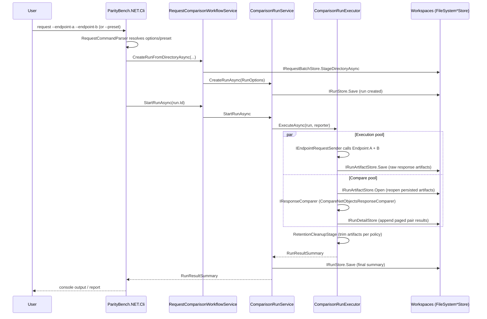

# High-Level Architecture

ParityBench.NET fires the same request at two endpoints (A and B), persists both responses as artifacts, compares them as domain objects, and appends paged results. Hosts (CLI, Web, Desktop) are thin composition roots over a shared set of application/engine/workspace services — none of them own comparison logic.

## Component map

| Layer | Project | Owns |
|---|---|---|
| Domain | [`Source/ParityBench.NET.Domain`](../../Source/ParityBench.NET.Domain) | Core model types, no framework dependencies |
| Application | [`Source/ParityBench.NET.Application`](../../Source/ParityBench.NET.Application) | Use-case contracts and orchestration: workflow, run lifecycle, results, contract-profile/response-model contracts |
| Engine | [`Source/ParityBench.NET.Engine`](../../Source/ParityBench.NET.Engine) | Run execution: endpoint calls, comparison, retention cleanup |
| Workspaces | [`Source/ParityBench.NET.Workspaces`](../../Source/ParityBench.NET.Workspaces) | File-system persistence: request batches, run/artifact/detail stores |
| Infrastructure | [`Source/ParityBench.NET.Infrastructure`](../../Source/ParityBench.NET.Infrastructure) | Concrete implementations: serialization, contract-profile registry, built-in profiles |
| Composition | [`Source/ParityBench.NET.Composition`](../../Source/ParityBench.NET.Composition) | Shared DI wiring (`WorkspaceServiceCollectionExtensions`) used by every host |
| Hosts | [`Source/ParityBench.NET.Cli`](../../Source/ParityBench.NET.Cli), [`Source/ParityBench.NET.Web`](../../Source/ParityBench.NET.Web), [`Source/ParityBench.NET.Desktop`](../../Source/ParityBench.NET.Desktop) | Thin entry points: parse input, call composition root, present results |
| Fixtures | [`Source/ParityBench.NET.TestEndpoints`](../../Source/ParityBench.NET.TestEndpoints) | Deterministic SOAP/XML/JSON endpoints for manual runs and E2E tests |
| Example | [`Source/ParityBench.NET.ClientCustomerLookupExample`](../../Source/ParityBench.NET.ClientCustomerLookupExample) | Reference contract profile — see [Adding a Custom Domain Profile](../Guides/adding-a-custom-domain-profile.md) |

Each project (other than Composition and the example) has its own `README.md` describing what it owns in more detail.

## Run flow (CLI `request` command)

Execution and comparison run as two bounded worker pools joined by a `System.Threading.Channels` channel inside `ComparisonRunExecutor` — execution persists a response artifact as soon as it lands, comparison reopens and diffs persisted artifacts rather than holding bodies in memory. This is what makes large runs (thousands of request pairs) bounded in memory rather than proportional to run size.

Web and Desktop hosts drive the same `RequestComparisonWorkflowService` / `ComparisonRunService` / `ComparisonRunExecutor` path — only the entry point (Blazor UI vs CLI args) and result presentation differ. All three hosts share one DI composition root: `Source/ParityBench.NET.Composition/WorkspaceServiceCollectionExtensions.cs`'s `AddParityBenchWorkspaceServices(...)`, with Web/Desktop additionally calling `AddParityBenchUiServices(...)` for UI-only concerns (accepted-differences store, job service, view-data adapters).

## Extending the system

To compare a new API pair with its own request/response shape, add a contract profile rather than modifying the engine — see [Adding a Custom Domain Profile](../Guides/adding-a-custom-domain-profile.md).
